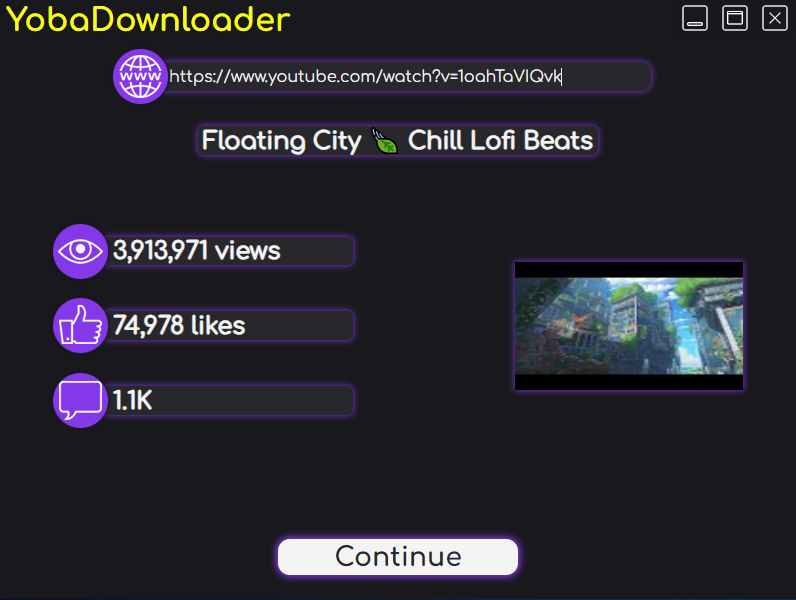

  

# YobaDownloader

Simple GUI YouTube downloader made with Rust and Tauri, some features may require FFmpeg to be installed.

# Features
- Video statistics (Likes, Views, Comments)
- Merging youtube audio/video streams (**FFmpeg** required)
- Converting streams to MP3 (**FFmpeg** required)
- Cutting videos (**FFmpeg** required)

# GUI

  

